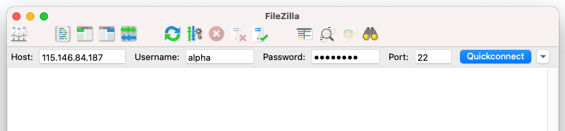

:::::::::::::::::::::::::::::::::::::: questions

- How do I move files between my computer and a remote machine?

::::::::::::::::::::::::::::::::::::::::::::::::

::::::::::::::::::::::::::::::::::::: objectives

- Transfer files between a local and a remote machine using FileZilla.

::::::::::::::::::::::::::::::::::::::::::::::::

In this section we will cover how to transfer files between a local and a remote machine using
[FileZilla](https://filezilla-project.org/).

::::::::::::::::::::::::::::::::::::: callout

### For in-person workshop participants

This section applies only to in-person workshop participants connecting to a provided Nectar
instance.

::::::::::::::::::::::::::::::::::::::::::::::::

When working on a remote machine like an HPC system, transferring data (in both directions!) is a
common task. FileZilla provides a useful interface for these transfers.

## Transfer files with FileZilla

Open FileZilla on your local computer. At the top of the window, enter the following information in
the boxes as shown in the image below.

| Field       | Enter the below information         |
| :---------- | :---------------------------------- |
| `Host:`     | IP address from provided spreadsheet |
| `Username:` | Username from provided spreadsheet  |
| `Password`  | Password from provided spreadsheet  |
| `Port`      | 22                                  |

{alt='Screenshot of the FileZilla application with the quickconnect bar fields highlighted'}

Select Quickconnect to establish a connection.

Now you can drag and drop files or whole directories to move them between a local and a remote
machine.

::::::::::::::::::::::::::::::::::::: caution

### Save your work

The provided Nectar instances will be turned off shortly after the completion of the workshop. If
you would like to save a copy of the files you have been working on, do that now.

::::::::::::::::::::::::::::::::::::::::::::::::

## Finished

Well done, you learnt a lot over the last 8 sections; it's a lot to take in!

From here you should be comfortable around the Unix command line and be ready to complete other
workshops based on the command line here at Melbourne Bioinformatics.

You will no doubt forget a lot of what you learnt here, so we encourage you to save a link to this
workshop for later reference. A summary table of every command used is on the
[Reference](../learners/reference.md) page.

## Additional resources

This workshop is just the tip of the Unix iceberg! There is lots more to learn out there. Below are
some resources that will help with further learning.

- [The HPC workshops](https://www.eventbrite.com.au/o/research-computing-services-10600096884) run
  by Research Computing Services (University of Melbourne researchers only) are a great intro to
  using a command-line interface to access an HPC system.
- [This tutorial](https://www.berniepope.id.au/assets/files/intro_to_unix.pdf) is a detailed intro
  to Unix programming by A/Prof Bernie Pope.

::::::::::::::::::::::::::::::::::::: keypoints

- FileZilla provides a drag-and-drop interface for transferring files to and from a remote machine.
- Connect with the host IP, your username and password, and port 22.
- Save any work off the remote instance before it is shut down.

::::::::::::::::::::::::::::::::::::::::::::::::
